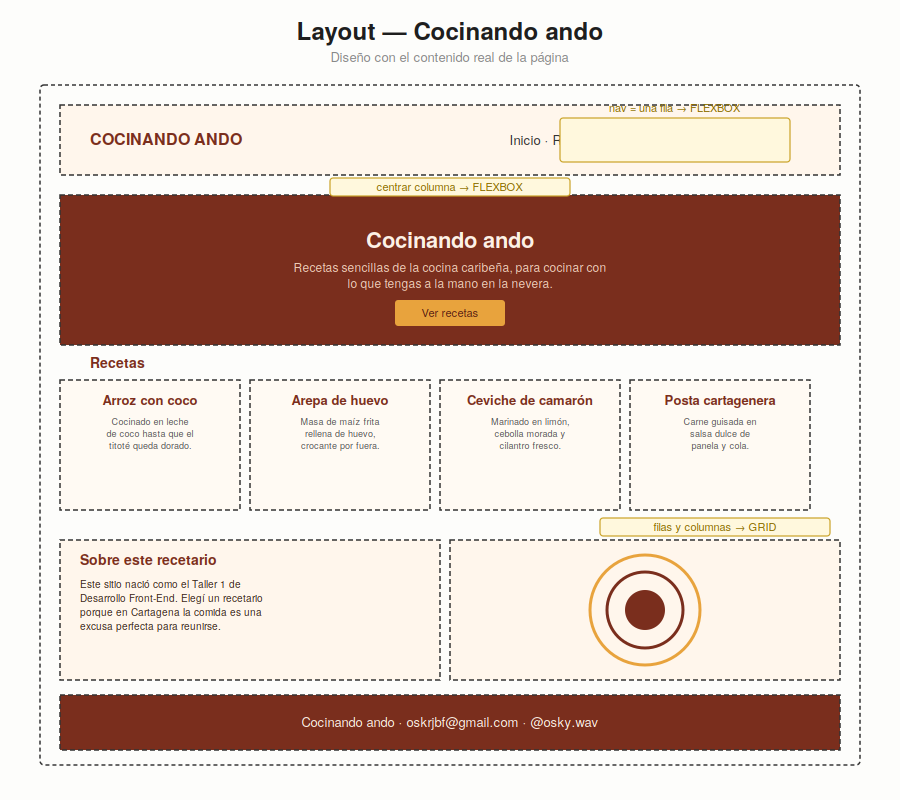

# Taller 1 — HTML/CSS: Flexbox & Grid

**Tema:** Recetario — "Cocinando ando"
**Curso:** Desarrollo Front-End — Semana 5

## Layout diseñado en Excalidraw



## Reflexión: ¿dónde usé Grid y dónde Flexbox?

**Flexbox** lo usé en cada zona que es *una sola fila o columna de elementos*:

- El `header`: es una fila con el logo a la izquierda y el menú a la derecha
  (`display: flex; justify-content: space-between`).
- El menú (`nav`): los enlaces van en una fila con espacio entre ellos (`gap`).
- El `hero`: el título, el subtítulo y el botón se apilan en una columna
  centrada (`flex-direction: column; align-items: center; justify-content: center`).
- El `footer`: una sola línea de texto centrada.

**Grid** lo usé en las dos zonas que sí son un *mapa de filas y columnas*:

- La sección de **Recetas**: cuatro tarjetas del mismo tamaño repartidas en
  columnas iguales (`grid-template-columns: repeat(4, 1fr)`). No es una fila
  simple porque además necesito que todas midan lo mismo y queden alineadas
  entre sí — eso es justamente lo que Grid resuelve mejor que Flexbox.
- La sección **Sobre este recetario**: dos columnas de distinto tamaño (texto
  + visual decorativo), con `grid-template-columns: 1.3fr 1fr`, para que el
  texto tenga más espacio que el círculo del plato.

En resumen: Flexbox dirige la fila (o la columna), Grid dibuja el mapa cuando
hay más de una dimensión que controlar, y el box model (`box-sizing: border-box`
aplicado primero que nada) evita que el padding y el borde rompan los anchos
calculados.

## Estructura del repositorio

```
index.html   → HTML semántico (header, nav, main, section, article, footer)
style.css    → box model + Flexbox + Grid
layout.png   → diseño del layout hecho en Excalidraw
README.md    → este archivo
```

## Restricciones respetadas

- Sin frameworks (Bootstrap, Tailwind).
- Sin JavaScript.
- Sin animaciones, transitions ni transforms.
- Sin variables CSS.
- Sin media queries (un solo ancho, para escritorio).
